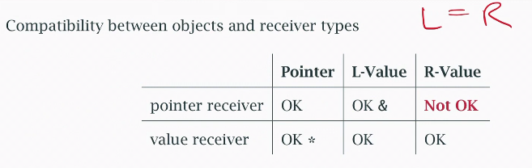
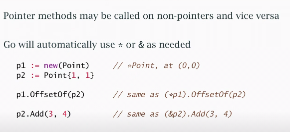

# Interfaces & Methods in Detail

[Video](https://www.youtube.com/watch?v=AXCIEiebVfI&list=PLoILbKo9rG3skRCj37Kn5Zj803hhiuRK6&index=20)

### Nil interfaces

An interface variable is `nil` until initalised.
It has two parts:
1. a value or pointer to the concrete type
2. a pointer to type info so correct method can be ID'd
```go
var r io.Reader         // nil until init
var b *bytes.Buffer     // ditto
r = b                   // r is no longer nil
                        // but has nil pointer to a Buffer
```


 #### Where it matters:
 `error` type is an `interface` with one method.
 We can compare it to `nil` unless we *make a mistake*.
 The *mistake* is to store a `nil` pointer to a concrete type in the error variable.
 ```go
 type error interface {
    func Error() string
 }
 ```
 #### We're not checking a value *in* error, just if the interface is `nil` or not.

 ### Pointer vs value receivers

 
 

A method requiring a pointer receiver may only be called on an addressable object.
 ```go
 var p Point
 p.Add(1, 2)            // OK: &p
 Point{1, 1}.Add(2, 3)  // Not OK: can't take address
 ```
 The `Point` literal isn't addressible; it's an R-Value.

### Consistency in receiver types
Mostly, if one method of a type take a ptr rec, that *all* its methods should take ptrs.

**In general, objects of that type are probably not safe to copy**

### Currying functions
Currying takes a function and reduces its argument count by one.
- One argument gets bound, and anew function is returned.
```go
// Ordinary add, returns sum of two ints.
func Add(a, b int) int {
    return a + b
} 

// Binding value to a, returning it into a new function that only takes a 'b' value, one argument. 
func AddToA(a int) func(int) int {
    return func(b int) int {
        return Add(a, b)
    }
}

// create a function addTo1, anything passed is being added to #1
addTo1 := AddToA(1)
Add(1, 2) == addTo1(2) // TRUE: the same result.
```

### Method values
A method value is a method closed over it's receiver.
A selected method may be passed similar to a closure; the receiver is closed over at that point.
```go
// <!> Point type not shown.

// In theory a 2 param function, the receiver p and param q.
func (p Point) Distance(q Point) float64 {
    return math.Hypot(q.X-p.X, q.Y-p.Y)
}

p := Point{1, 2}
q := Point{4, 6}

// Closed over and 'captured' receiver p, doesn't need to be spec'd again.
distFromP := p.Distance // This is the method value,
distFromP(q)            // which can be called later.
p.Distance(q)           // This is the equiv to above.
```

### Interfaces in practise
1. Let consumers define interfaces
   - What *minimal* behaviour do they require?
   - e.g. `Writer`, pass me whatever you like that can `Write()`.
2. Re-use standard interfaces wherever possible.
   - Maximises capatability.
3. Keep interface declarations small.
   - The bigger the interface the weaker the abstraction.
   - Focus on the *essence*.
   - e.g. interface with 40 methods, where only 2 are used, make 2 interfaces and a 3rd which is composed of them.
4. Compose one-method interfaces into larger interfaces (if needed).
   - `ReadWriteClose` type. 
5. Avoid coupling interfaces to particular types/implementations.
   - Don't tie it to a particular implementation and keep it abstract. 
6. Accept interfaces, but return contrete types.
   - Let the consumer of the return type decide how to use it.

### Interfaces vs concrete values
*"Be liberal in what you accept, conservative in what you return".*
1. Put the least restirction on what params you accept (the *minimal* interface).
   - e.g. don't require `ReadWriteCloser` if you only need `Read()`.
2. Avoid restricting the use of your return type.
   - The concrete value returned might fit many interfaces.
   - Returning `*os.File` is less restrictive (has more methods).
   - Returning `io.ReadWriteCloser` is more restrictive (has less methods).
3. Returning `error` is a good example of an exception to this rule.
   - A `nil` interface is not the same as a `nil` pointer/value.

### Empty interfaces
The `interface{}` has no method set, so can be satisfied by anything.

Empty interfaces are commonly used; they're how the formatted I/O routines can print any type:
```go
// takes variable argument list via variadic param.
func fmt.Printf(f string, args ...interface{})
```
*Reflection* is needed to determin what the conrete type is.