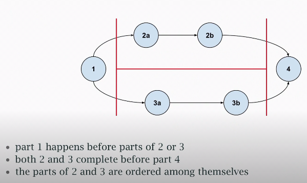
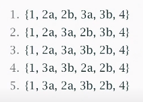
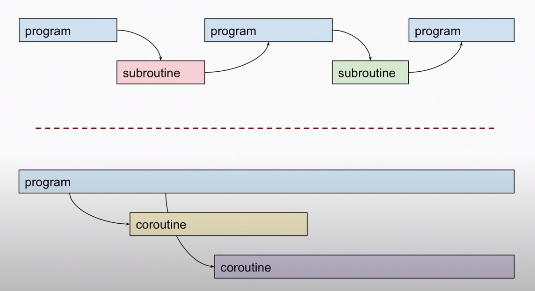
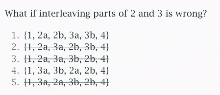
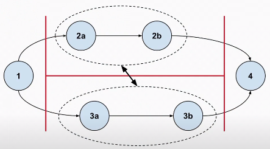

# What is Concurrency?

#### Side note:
CTRL+K erases everything from the current cursor position to the end of the line. Shortcuts: Instead of Backspace, use CTRL+U. Instead of Delete, use CTRL+K.

### Some definitions
- Execution happens in some non-deterministic order.
- Underdefined out-of-order execution.
- Non-sequential execution.
- Parts of a program execute out-of-order or in partial order.

### Partial order
Opposite from **Total Order**, e.g integers: order between any two ints.

Partial order, some are ordered and some aren't.

### Non-deterministic
Different behaviours on different runs, even with the same input.
Note, we don't necessarily mean different results, but a **different trace of execution**. The states internally might be reached in different orders.

### Execute independently
Subroutines are subordinate, while coroutines are co-equal.

### Concurrency

Parts of the program may execute independently in some non-deterministic (partial) order.

- If they run at the same time, they're running in **parallel**. 
- You can have concurrency with a single-core processor.
- Need concurrency to enable parallelism.

### Parallelism

Parts of the program execute independently at the same time.
- Can only happen on a multi-core processor.

### Concurrency vs Parallelism

Concurrency is about dealing with things happening out-of-order
- Parallelism is about things actually happening at the same time.

A single program won't have parallelism without concurrency.

### Race condition
In short, a bug.

System behaviour depends on the (*non-deterministic*) sequence or timing of parts of the program executing independently, where some possible behaviours (*orders of execution*) produce invalid results.

### Some ways to solve race conditions

Race conditions involve indep. parts of the program changing things that are shared.

Solutions to make sure operations produce a consistent state to any shared data:
1. don't share anything
2. make the shared things read-only
   - reading a large dataset
3. allow only one writer to the shared things
4. make the read-modify-write operations atomic
   - reducing concurrency, but is a necessary cost.

In the last case, we're adding more (sequential) order to our operations.

