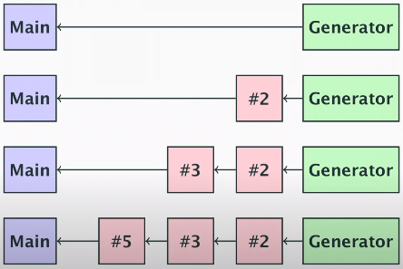

# Share memory by communicating

CSP = Communicating Sequential Processes

[Video](https://www.youtube.com/watch?v=zJd7Dvg3XCk&list=PLoILbKo9rG3skRCj37Kn5Zj803hhiuRK6&index=23)

### Channels
- Like a unidirectional socket or Unix pipe, sends data (*one-way*) from one program to another.
- Are open until closed.
- Multiple readers and writers can share it safely.
- Method of sync as well as comms.
- Vehicle for **transferring ownership of data**, e.g. so that one goroutine at a time is writing data.

**Channels can help us deal with the "happens before" relationship.
**

### Sequential Process

Looking at a single independent part of the program, it appears to be sequential, e.g.
```go
for {
    read()
    process()
    write()
}
```

### CSP
Now put both together with channels to communicate.
- each part is independent.
- all they share are the channels between them.
- the parts can run in parallel as the HW allows.
- can be scheduled in a way that the result is a concurrent/parallel program.

CSP provides a model for thinking about it that makes it less hard, async code in an sync style.

### Goroutine
- A unit of independent execution (coroutine).
- A go routine is not a thread.

Know how to the goroutine will stop:
1. well-defined loop terminating condition.
2. signal completion though a channel or context.
3. let it run until the program terminates.

**Don't let it get orphaned, or blocked by mistake.
**

### Prime Sieve Example

Generator will keep incrementally generating numbers from 2 onwards.

Every time main() sees a new prime number, it will create another go routine, hook it into the channel it's getting numbers from, and create a new channel back to itself.

