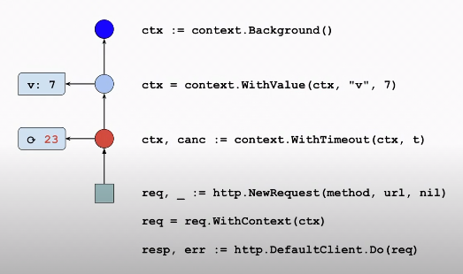

# Context

[Video](https://www.youtube.com/watch?v=0x_oUlxzw5A&list=PLoILbKo9rG3skRCj37Kn5Zj803hhiuRK6&index=25)

`context` offers a common method to **cancel requests**, explicitly via a function, or implicitly via a timeout or deadline (more common).

A `context` may also carry request-specific values, such as trace IDs.

Many network or database requests, for example, take a context for cancellation.

## Cancellation and timeouts

A context offers two controlls:
1. a channel that closes when the cancellation occurs
2. an error that's readable once the channel closes

The errror values tells you whether the request was cancelled or timed out.

We often use the channel from `Done()` in a `select` block.
- If the channel becomes ready to read, signal to terminate.
- Calling `Error()` will provide the reason why, e.g. timeout or explicit cancel.

## Context is a tree

Forms an immutable tree structure (goroutine-safe; changes to a context do not affect its ancestors). Has some root context without information, nodes are made and are immutable. You don't modify context, you create new nodes pointing to parents above it. The tree is walked from the bottom, not the top.

Have to be immutable, as they're passed via goroutines.
That also means that you can only add immutable types as a context value. 

Cancellation or timeout applies to the current context and its subtree; children point back up.



Ditto for value

A subtree may be created with a shorter timeout (but no longer).

## Context example

If passing to a function:
1. pass as a param
2. pass it as the **first** param

```go
// First runs a set of queries and returns the result from the
// first to respond, cancelling others.
funct First(ctx context.Context, urls []string) (*Result, error) {
    c := make(chanResult, len(urls)) // buffered to avoid orphans
    ctx, cancel := context.WithCancel(ctx)

    defer cancel() // cancel the other queries when we're done

    search := func(url string) {
        c <- runQuery(ctx, url)
    }
}
```

## Values

We can attach values to a context, and they're available in the various places below the tree.
```go
ctx := context.Background()
ctx = context.WithValue(ctx, "v", 7) // v: 7
```

Context values should be data specific to a request, such as:
1. a traceID (global tracing) or start time (for latency calculation)
2. security or authorisation data

Avoid using the context to *"carry"* optional parameters, or stuctural parts of the program (e.g. a logger).

Need to put keys on variables we store in the context for look up.
Use a package-specific, private context key type (not string) to avoid collisions.
e.g. string "traceID", if who's traceID is it?

Example:
```go
type contextKey int // not exported

const TraceKey contextKey = 1 // is exported

// AddTrace is HTTP middleware to insert a trace ID into the request.
// Middleware is a go context is a handler func that returns a handler.
// The handler `next` is passed in, we something, then call the next handler.
// i.e. it becomes a link in a chain.
func AddTrace(next http.Handler) http.Handler {
    return http.HandlerFunc(func(w http.ResponseWriter, r *http.Request){
        ctx := r.Context() // get in incoming context

        // look at the headers of req for the var we're expecting (X-Cloud-Trace-Context), and confirm it's there and not empty
        if traceID := r.Header.Get("X-Cloud-Trace-Context"); traceID != "" {
            ctx = context.WithValue(ctx, TraceKey, traceID) // add it to the req
        }

        next.ServeHTTP(w, r.WithContext(ctx)) // and future handlers will have the var
    })
}
```
Useage; a simplified logging function, that's not real world...
```go
// ContextLog make a log with the trace ID as a prefix.
func ContectLog(ctx context.Context, f string, args ..interface{}) {
    // Does it have the traceID? - like a map.
    traceID, ok := ctx.value(TraceKey).(string) // reflection, get value out of the "map", and try to make it be a string. - the ok means it worked.

    if ok && traceID != "" { // it wasn't convertable to string, or it's empty
        f = traceID + ": " + f
    }

    log.Printf(f, args...)
}

```
