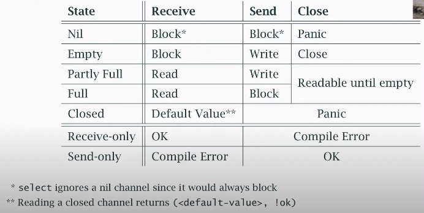
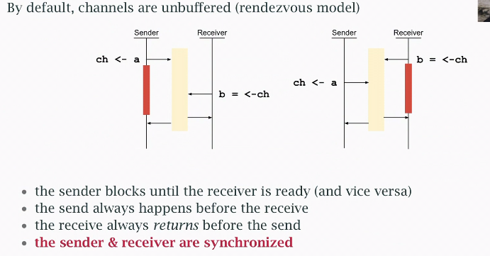
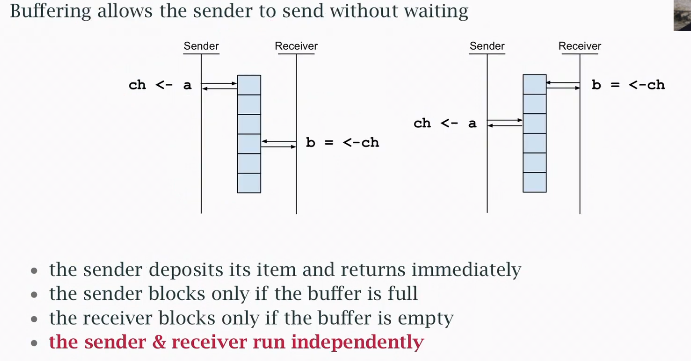

# Channels & Synchronisation

[Video](https://www.youtube.com/watch?v=fCkxKGd6CVQ&list=PLoILbKo9rG3skRCj37Kn5Zj803hhiuRK6&index=26)

## Channel state

Channels block unless ready to read or write.

A channel is ready to write if:
- it has buffer space to
- at least one reader is read to read (rendezvous)

A channel is ready to read if:
- it has unread data in it's buffer
- at least one writer is ready to write (rendezvous)
- it is closed

Channels are unidirectional, but have two ends, which can be passed seperately as parameters.
- an end for writing and closing:
```go
func get(url string, ch chan<- result) {
    ... // write-only end
}
```
- an end for reading:
```go
func collect(ch <-chan result) map[string]int {
    ... // read-only end
}
```
Closing a channel causes it to return the "zerp" value (default).
We can also receive a second value: *is the channel closed?* like key look ups in maps. 
```go
func main() {
    ch := make(chan int, 1)
    ch <- 1

    b, ok : <-ch
    fmt.Println(b, ok) // 1 true
    close(ch)

    c, ok := <-ch
    fmt.Println(c, ok) // 0 false, channel closed
}
```
## Closed channels

A channel can only be closed once, else it will panic.

One of the main issues in working with goroutines is **ending** them:
- An unbuffered channel requires a reader and writer. A writer blocked on a channel with no reader with "leak".
- Closing a channel is often a signal that work is done.
- Only **one** goroutine can close a channel, not many.
- We maybe need some way to coordinate closing a channel or stopping goroutines (beyond the channel itself).

## `nil` channels

Reading or writing a channel that is `nil` always blocks *.

But a `nil` channel in a `select` block is *ignored*.

This can be a powerful tool:
- Use a channel to get input
- Suspend it by changing the channel variable to `nil`
- You can even un-suspend it again
- But **close** the channel if there *really is* no more input (EOF)

## Channel state reference


## Rendezvous
Channels as a synchronisation tool. The send waits for the Receiver to receive


Buffering allows the sender to send without waiting.
Sending and Receiving are disconnected, the Sender doesn't know the Receiver received.

*Assume buffer has capacity*

## Buffering

Common uses of buffered channels:
- avoid goroutine leads (from an abandoned channel).
- avoid rendezvous pauses (performance improvement).

Don't buffer until it's needed: buffering may hide a race condition.

Some testing may be required to find the right number of slots

Special uses of buffered channels:
- counting semaphore pattern

## Counting semaphores

Limits work in process (or occupancy)

Once it's full only one unit of work can enter for each one that leaves.

We model this with a buffered channel:
- attempt to send (write) before starting to work
- the send will block if the buffer is full (occupancy is at max)
- receive (read) when the work is done to free up a space in the buffer (this allows the next worker to start)