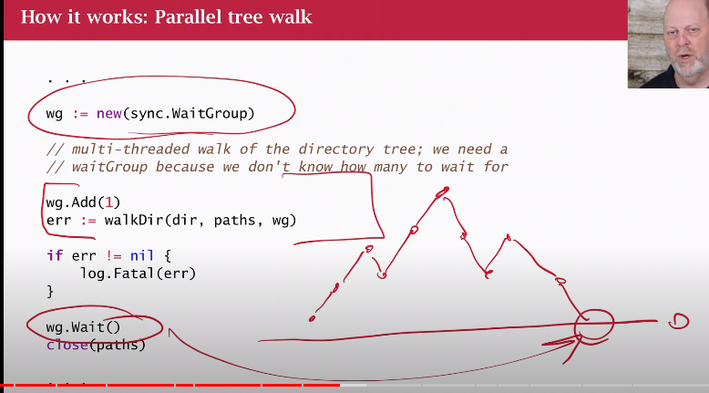
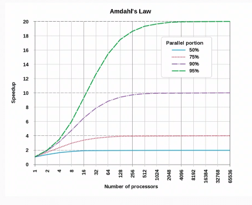

# File Walk Example (CSP)

Concurrent sequential processes (goroutines and channels)

[Video](https://www.youtube.com/watch?v=SPD7TykYy5w&list=PLoILbKo9rG3skRCj37Kn5Zj803hhiuRK6&index=27)

## What's the problem?

I want to find duplicate files based on their content.

Use a secure hash, because the names/dates may differ.
Using hashes will tell us that the byte data is identical regardless of the metadata.

[github.com/matt4biz/go-class-walk](https://github.com/matt4biz/go-class-walk)

`runtime.GOMAXPROCS(0)` how many threads should go create based on the hardware, i.e. the number of logical cores.

Wait groups don't have an upper limit, but does have a lower.

