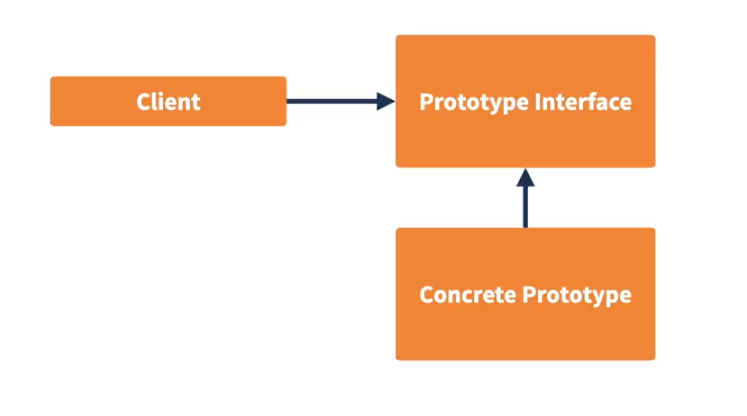

# Design Patterns in Go for Object Oriented Programming

[Course](https://www.linkedin.com/learning/design-patterns-in-go-for-object-oriented-programming/)

### Contents:
1. [Creational Patterns](#creational-patterns)

## What are design patterns
### What:
- Only applicable to OOP.
- Formalised, generalised approached to a repeated problem.
- Describe how different classes or object in a project may depend on or interact with each other.
- Solve a specific problem, and provide context for why the problems occurs.

### Why:
- Organise and maintain codebase.
- Transform abstract ideas into clear solutions.
- Provide a common understanding for developers.

## Types of patterns
### Three main types:
1. Creational:
   - Create objects and classes.
   - Provide an interface for creating objects or families of related objects.
   - Help construct complex objects.
   - Limit dependencies and instances of objects.
2. Structural
    - Assemble objects and classes into larger structures.
    - They allow incompatible object types to collaborate.
    - Allow incompat object types to collaborate.
    - Separate abstraction and implementation.
    - Attach different behaviours to objects.
3. Behavioural
    - Algorithms and relationships between different objects
    - Pass info along different objects
    - Notify other objects of different behaviour
    - Separate the object from the algorithm

## OO in Go
- No classes, but struct to define custom user types.
- `struct` hold state but not behaviour.
- Functions apply behaviour to a reciever.

### Polymorphism
- `interfaces` allow for polymorphism.
- They declare method sets
- Types that have the same method set satisfy that interface.

## Creational Patterns
Manage object creation in your system
Encapsulate knowledge of the classes in the system
Hide instances of the classes that are created and combined

### Classiciation of Creational Design Patterns
1. Object creational patterns 
   - defer object creation to another object.
2. Class creational patterns 
   - defer class creation to subclasses.

### Creational Patterns Contents:
1. [Builder](#builder)
2. [Factory Method](#factory-method)
3. [Abstract Factory](#abstract-factory)
4. [Prototype](#prototype)
5. [Singleton](#singleton)

### Builder
#### What:
- Enables construction of complex objects step-by-step
- Each step is independent of the others 
#### Why:
- Get rid of *telescoping constructor*.
- Create different representations of the same object.
- Construct composite trees of other complex objects.
#### Structure:

#### Pros and Cons:
| Pros | Cons |
| :--- | ---: | 
| Reuse the same constuctor code  |  Makes the code more complex as requires implementation of new classes |
| Defer different constuction steps or implement them recursively |  |
| Isolate complex parts of the code |  |

### Factory Method
#### What:
- Defines an interface or abstract class for creating an object.
- Subclasses are responsible for creating instances of that class.
#### Why:
- Useful when the exact dependencies of the objects are unknown.
- Helpful when building lib or framework used for a various uses.
- Reuse exisiting objects instead of creating new ones.
#### Structure:

#### Pros and Cons:
| Pros | Cons |
| :--- | ---: |
| Promotes loose coupling, lessening deps | Too many subclasses makes the code more complex |
| Moves class creation into a single place |  |
| Can introduce new objects without breaking codebase |  |

### Abstract Factory
#### What:
- Set of factory methods.
- Defines an interface or abstract class for creating a family of related objects.
- Subclasses are responsible for creating instances of those various classes.
#### Diff Factory:
It's one step above the Factory Method pattern.
| Factory | Abstract Factory |
| :--- | ---: |
| Hides construction of **one** product | Hides the construction of a **family** of similar products |
| Uses **encapsulation** to delegate responsibility | Uses **composition** to delegate responsibility to subclasses |
#### Why:
- Don't know exact deps of the family of classes in codebase beforehand.
- Allow for future expansion.
#### Structure:

#### Pros and Cons:
| Pros | Cons |
| :--- | ---: |
| Ensure all related classes/products work together | More complexity with different interfaces and classes |
| Promotes loose coupling within codebase | |
| Move class creation to a single place | |
| Can introduce new objects without breaking | |

### Prototype
#### What:
- Creates a copy of an object without it being costly.
- Object isn't dependent on specific classes or object.
#### Why:
- Reducing the amount of subclasses.
- Classes in system only initalised at runtime.
#### Structure:
#### Pros and Cons:
| Pros | Cons |
| :--- | ---: |
| Two different copied objects won't be coupled | Complex objects are tough to copy |
| Removes repeated init | |
| Alternative to inheritance | |

### Singleton
#### What:
- A single class creates an object
- Only one object gets created
#### Why:
- One instance of a class gets created, e.g. DB or file.
- Global access point for that class, single instance accessed anywhere.
#### Structure:

#### Pros and Cons:
| Pros | Cons |
| :--- | ---: |
| Know only one object is created for the class | Goes against single responsibility principle |
| Global access point | Both object and class creational pattern |
| Only init once | Difficult to test, because it's hard to mock |
| | Requires special attention in multi-thread env |
