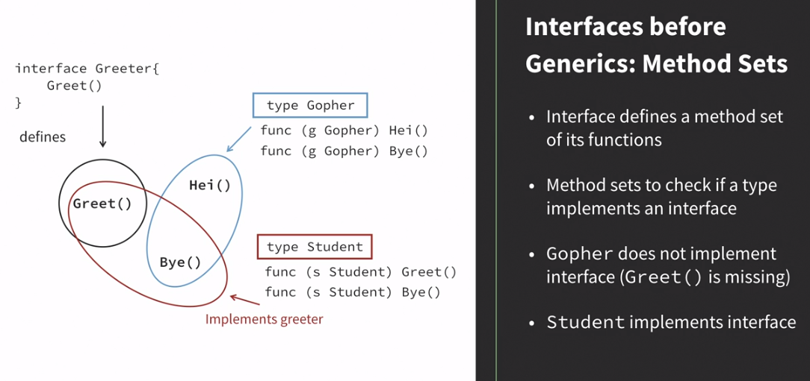
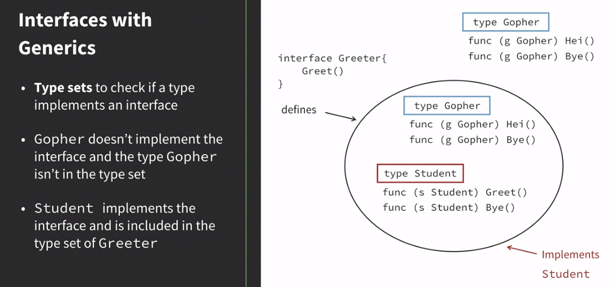

# Generics in Go

[Course](https://www.linkedin.com/learning/generics-in-go/)

- Go above 1.18
- Using fictional company for exercises
- [Exercise files](https://github.com/LinkedInLearning/generics-in-go-2492215)

## Contents
1. [Type Parameters](#1-type-parameters)
2. [Type Sets](#2-type-sets)
3. [Type Inference](#3-type-inference)
4. [Generics in Practice](#4-generics-in-practise)

## 1. Type Parameters
New syntax to enable generics in go.

### Function and type Declarations
Extend function signature, adding an optional list of type parameters.
- They're considered abstract until runtime, when replaced with concrete types.
```go
func name(p int) int {...}

func name[T any](p T) int {...}
```
### Type Constraints
- Restrict type parameters to accept certain types.
- `any` includes all types like `interface{}` does.

### Example A
```go
// Boiler plate A - print info about a solar product.
func (s *Solar) Print() string {
    return fmt.Sprintf("%s - %v\n", kinetecoPrint, *s)
}

// Boiler plate B - Print info about a wind product.
func (s *Wind) Print() string {
    return fmt.Sprintf("%s - %v\n", kinetecoPrint, *s)
}

// Combine both in a generic.
func PrintGeneric[T any](t T) string {
    return fmt.Sprintf("%s - %v\n", kinetecoPrint, t)
}

```

## Instantiation of Generic Functions

### Call Functions with Type Arguments
```go
i := 42

j := name(i)
k := name[int](i)
```
### Example B
Calling the generic made in [Example A](#example-a)
```go
func PrintGeneric[T any](t T) string {
    return fmt.Sprintf("%s - %v\n", kinetecoPrint, t)
}

...

solar2K := business.Solar("Solar 2000", 4.500)
business.PrintGeneric[business.Solar](solar2K)

```
### Example C
Type parameter with composite type, prints a slice of strings with [previous generic](#example-b).
```go
func PrintSlice[T any](tt T[]) {
    for i, t := range {
        fmt.Printf("%d: %s\n", i, PrintGeneric[T](t))
    }
}

...

ss := []business.Solar{solar2k, solar3k}
business.PrintSlice[business.Solar](ss)
// Works with other type literal.
business.PrintSlice[business.Wind]([]business.Wind{windwest, windwest})
```

## 2. Type Sets
A type set includes types defined in an interface.

### Interfaces Pre-Generics
Before 1.18, a `interface` defines a method set of its functions.

A `type` implements an `interface` if it has the methods defined in the `interface`.
- i.e. the specification of interfaces focused on method sets, not concrete types.

### Interfaces Post-Generics
Stopped looking into method sets and instead to types.
Build a type set instead of a method set.

- A type set includes types defined in an interface.
- A type set can include methods and types.

### What can be in a Type Set?
- Empty interface: all non-interface types
- Non-empty interface: intersections of all elements
  - Method, for example, `Read`
  - Non-interface type, for example, `int`

### Define Type Sets
### Example D
Following on from [Example C](#example-c)
```go
type Solar struct {
    Name string
    Netto float64
}

func (s Solar) Cost() float64 {
    return s.Netto * 0.4
}

type Wind struct {
    Name string
    Netto float64
}

func (s Wind) Cost() float64 {
    return s.Netto * 0.4
}

type Energy interface {
    // Allow either of the two energy types.
    Solar | Wind
    Cost() float64
}

// From any to new Energy interface, now restricted.
func PrintGeneric[T Energy](t T) string {
    return fmt.Sprintf("%s - %v\n", kinetecoPrint, t)
}

// From any to new Energy interface, now restricted.
func PrintSlice[T Energy](tt T[]) {
    for i, t := range {
        fmt.Printf("%d: %s\n", i, PrintGeneric[T](t))
    }
}
```

### Experimental package: Constraints
New package, `constraint`. Provides six common constraints for type parameters.

### `type` Complex
- `Complex` constraint for any complex number
- `Complex` will include future complex standard Go types.
- The `~` allows for all subtypes.
```go
type Complex interface {
    ~complex64 | ~complex128
}
```

### `type` Float
- `Float` constraint for any floating-point number
- `Float` will include future floating-point number standard Go types.
- The `~` allows for all subtypes.
```go
type Float interface {
    ~float32 | ~float64
}
```

### `type` Signed (same for Unsigned)
- `Signed` constraint for any signed integer number
- `Signed` will include future signed integer standard Go types.
- The `~` allows for all subtypes.
```go
type Signed interface {
    ~int  | ~int8 | ~int16 | ~int32 | ~int64
}
```

### `type` Integer (Signed Unsigned combined for Unsigned)
- `Integer` constraint for any integer number
- `Integer` will include future integer standard Go types.
- The `~` allows for all subtypes.
```go
type Integer interface {
    Signed | Unsigned
}
```
### `type` Ordered
- `Ordered` constraint for any type that supports order operators (<<=>=>)
- `Ordered` will include future standard Go types that can be ordered
- The `~` allows for all subtypes.
```go
type Ordered interface {
    Integer | Float | ~string
}
```

## 3. Type Inference
### Function Arguments Type Inference
Compiler assumes a type you didn't declare. Convenience feature to omit square brackets in function call
### Example F
```go
// This..
business.PrintGeneric[business.Solar](solar2k)
// can become with type inference.
business.PrintGeneric(solar2k)
```
### Constraint Type Inference

### Example G
From [Example C](#example-c)
```go
ss2 := business.SolarSlice{solar2k, solar3k}
// Type arguments are ommited when calling the function. 
business.PrintSlice(ss2)

// S is constrained by a slice of T and its underlying types.
// The []T parameter is now replaced with S.
// Infers the correct type.
func PrintSlice2[T Energy, S ~[]T](tt S) {
    for i, t := range {
        fmt.Printf("%d: %s\n", i, PrintGeneric[T](t))
    }
}
```
## 4.Generics in Practice
### Best practice
1. Use generics to avoid boilerplate code
2. Narrow down type parameters
3. *For which types would I write the function without generics?*

### Example of pragmatic use:
#### Type-Independent
- A function that doesn't require methods or fields of a type in the function body.
  - e.g. a function that returns the keys from a map
  - Without generics:
    - Use empty `interface`, and cast the slice back to the desired type at the receiver.
    - Or simply be ok with receiving a slice with an empty `interface`.
#### 2 Types, 1 Method
- Several types share the same method, therefore, the function body is equal between the different methods; minus the differing types.
#### Data Structures
- Data structures that can be independent from a concrete type.
- e.g. Linked lists.

### Experiment Package: Slices
Use `slices` for sorting, deleting, binary search, etc..
```go
// Need to sort different energy options sorted by cost.
func SortByCost[T Energy](a [T]){
    // uses SortFunc from slices.
    slices.SortFunc(a, func(a, b T) bool {
        return a.Cost() < b.Cost() || math.IsNaN(a.Cost()) && !math.IsNan(b.Cost())
    })
}
// Check if changed:
fmt.Printf("index %d\n", slices.Index(ss, solar2K)
business.SortByCost(ss)
fmt.Printf("index %d\n", slices.Index(ss, solar2K)
```
### Experiment Package: Maps
Use `maps` to handle typical maps functions.
Example, receiving the slice from keys of a map..
```go
contracts := make(map[int]business.Solar)
... // fill the contracts with ids
contractIDs := maps.Keys(contracts) // returns all keys from the map
```

### Known Limitations
- No field access:
  - Workaround: Write a method to access, add method to constraints, use the method to return the fields.
- No *"Zero"* value:
  - It is `nil`.
  - Workaround: Declare a variable without assignment, use the variable.
- No methods:
  - Workaround: Write a function, use the function.